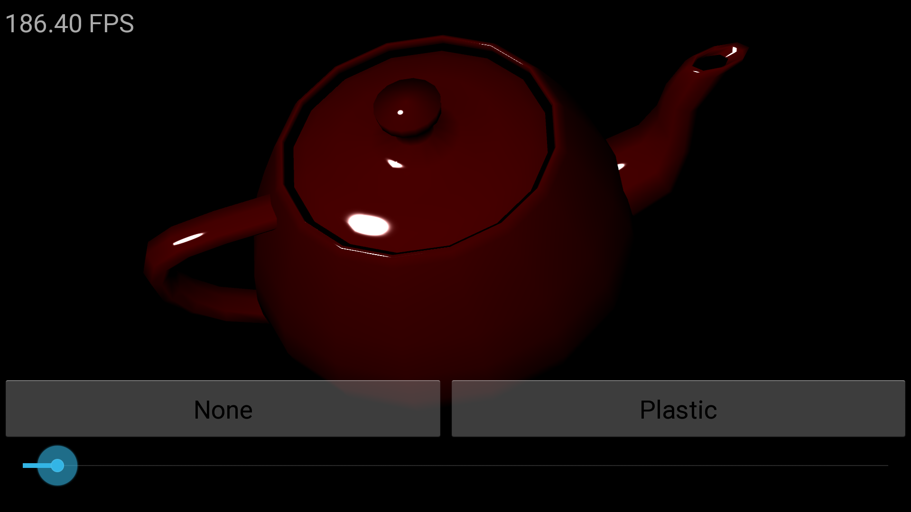
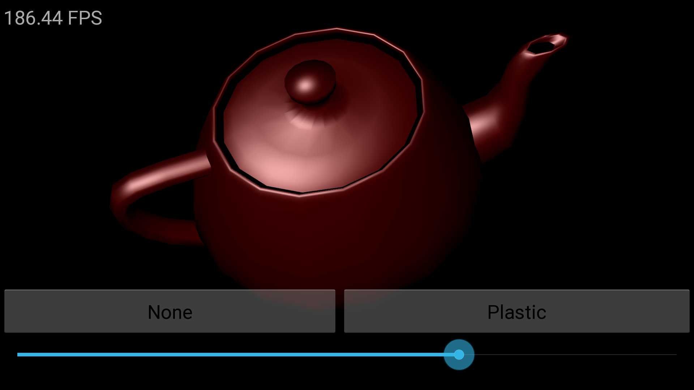
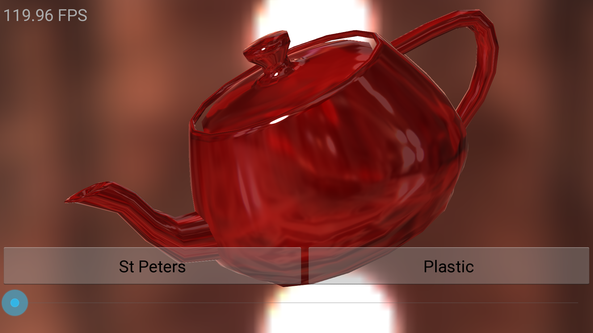
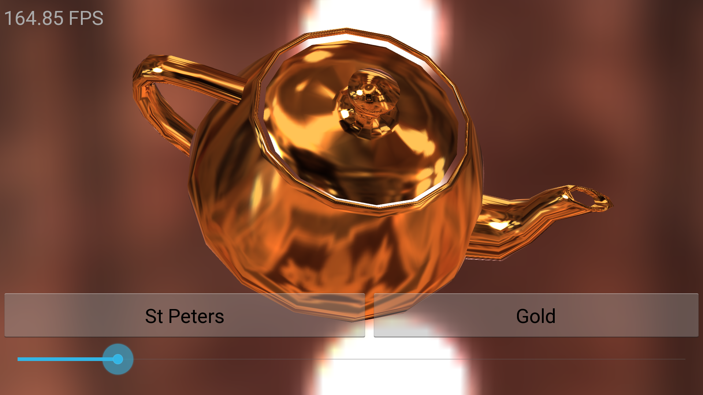
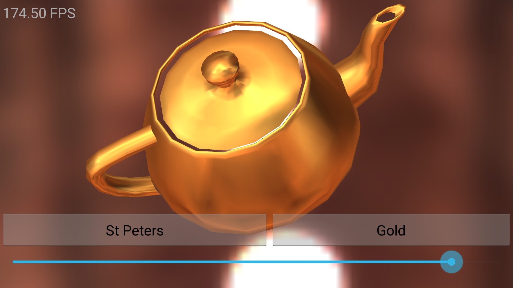

AndroidPhysicallyBasedRendering
===============================

Physically Based Rendering is a new rendering method which most of console/desktop game developers (and the movie industry as well) are moving on.
Instead of a traditional material based rendering pipeline (e.g. base, specular power & normal map etc), PBR pipeline has physically correct (or nearly correct) lighting model and artists tweak physically model parameters in a consistent way. (usually Albedo, Specular, Roughness & Normal).

In Mobile gaming space, PBR is not popular yet due to limited HW performance/features, however high-end devices such as TegraK1, Adreno330 are capable of PBR in terms of feature set (, still not fully ready in performance though). As they are getting more popular, Mobile games will also adopt PBR in near future.

PBR in a nutshell:
- Energy conserving
Input light energy >= Output energy.
In pictures below, note that a specular intensity increases as a specular power increase

- Fresnel for everything (including non-conductor)

- Metalic material == Specular only
Pictures below: They are all specular but with different 'roughness' value

DEMO:
- Demo uses 1 irradiance environment map (fetched both diffuse,specular), 1 direction light.
- Lambart diffuse, Phong specular + Schlick fresnel
- All images above are rendered in single PBR shader.
- Requires OpenGL ES3.0 (details below)

Implementation details:
- Requires OpenGLES3.0
Most of existing PBR implementations require CubeMapLod (EXT_shader_texture_lod),
but many of Android devices don't support the feature unfortunately.
In OpenGLES3.0, cubemap LOD is required by spec, so basically in Android, PBR requires OpenGLES3.0. 
Good news is that these devices are quite likely high-end device that are capable of PBR in performance-wise so that they are overlapping.

- Linear space lighting and sRGB conversion
  In PBR (or even in modern-traditional rendering pipeline as well), rendering pipeline performs lighting in linear space and performs sRGB conversion when read (from image textures) and write (to RT).
  In Android, sRGB render target (KHR_gl_colorspace) is not supported in most devices, so linear space lighting does not work in straightforward manner.
  Possible workaround would be,
  - Need to convert in shader,
  - Render to sRGB FBO and copy
  In demo, manual conversion significantly dropped performance, so it's not doing conversion at all.

- Performance
PBR shader I wrote takes 74 instructions in VS, and 125 insts in FS (with 2 tex fetch).
They run in a decent performance in N5 @~230 FPS with 1080p,
